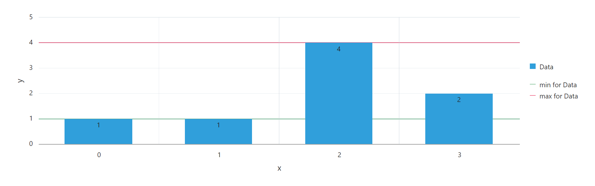

# Oracle APEX: Reference Objects in JET Charts


When developing Applications in Oracle APEX, you may want to display some data in JET Charts. In this article, I will show you how to add additional lines and areas to your JET Charts to mark special values like an average, minimum or maximum.

## Exploration

After creating a region of type `Chart`, go to its `Attributes` and scroll down to `Advanced`. Here, you can define a JavaScript-Function which will be called when the chart is initialized.

> If you don't care about manually exploring a JET Chart and potentially learning some JavaScript, you can skip this chapter and continue at [Adding a Static Reference Object to an Axis](#adding-a-static-reference-object-to-an-axis).

### Testing

To test if this works, try entering the following function:

```js
() => {
  alert('chart initialized');
}
```

Save your changes and reload the page. You should now get an alert while the chart is being initialized.

### Explore your options

A function like that may be fine in some cases, but it's not very helpful if you want to dynamically execute code depending on attributes of your chart. That is why APEX passes argument(s) to this function. To see how many arguments there are, you can use [spread syntax][spread_syntax] and log the number of items received:

```js
(...args) => {
  console.log(args.length); // -> 1
}
```

After saving & reloading once again, you can see that in your [developer console][dev_console], it says the number of items in `args` is 1.
So, let's update the function header and examine that argument:

```js
(arg) => {
  console.log(arg); // -> {...}
}
```

The console now outputs an object that contains information about the chart, such as its `type`, `hideAndShowBehavior` etc.
We will call this object `options` from now on.

When further exploring your `options`, it does not seem like there's any property for adding reference objects nor can any of the datapoints displayed in the chart be found. So, how can a reference object be added to an axis?

## Adding a Static Reference Object to an Axis

It may not be shown in your console output, but every axis can have the property `referenceObjects`. This is an array which can hold multiple reference objects, which there are two types of:

1. `type: 'line'`
   - default type
   - needs a `value`

    ```js
    (options) => {
      options.yAxis.referenceObjects = [];  // initialize array so that we can .push()

      const refLine1 = { type: 'line', value: 5.5, color: 'red' };  // explicit type
      const refLine2 = { value: 7, color: 'darkgreen' };

      options.yAxis.referenceObjects.push(refLine1, refLine2);

      return options;
    }
    ```

2. `type: 'area'`
   - needs a range (`low` and `high`)

    ```js
    (options) => {
      options.xAxis.referenceObjects = [];
      options.yAxis.referenceObjects = [];

      const refAreaX = { type: 'area', low: 0.5, high: 1.5, color: '#00cc00'};
      const refAreaY = { type: 'area', low: 1, high: 5, color: 'rgb(0, 180, 200)' };

      options.xAxis.referenceObjects.push(refAreaX);
      options.yAxis.referenceObjects.push(refAreaY);

      return options;
    }
    ```

>It is important to note that the **`options` must be returned**. Otherwise, your changes to this object will not be applied.

Both types of reference objects have additional properties, of which the most important probably are:

| Property        | Type                  | Description                                                                 |
| --------------- | --------------------- | --------------------------------------------------------------------------- |
| location        | `'front'` \| `'back'` | Whether to display the object behind or in front of the data items.         |
| displayInLegend | `'on'` \| `'off'`     | Whether to display the object in the legend.                                |
| text            | string                | The object's name in the legend                                             |
| shortDesc       | string                | Text displayed when hovering over the object (line/area and legend).        |
| color           | string                | The color of the object. Can be any valid [`CSS <color>`-value][css_color]. |
| lineWidth       | number                | The width of a reference line in pixels.                                    |

>For a complete list of properties, visit the [documentation for referenceObject][refObj_doc].

## Adding Dynamic Reference Objects

When you want to add a reference object that depends on the chart's data, you can set a function for `dataFilter` on your `options`. This function will be executed after data has been fetched. It can have an argument, `data`, which mainly contains information about the chart's series and their datapoints.

```js
(options) => {
  options.dataFilter = (data) => {
    console.log(data);

    return data;
  }

  return options;
}
```

From the `data` object you can now add a reference object to `options` inside of the `dataFilter` function, for example a line marking the minimum and maximum values:

```js
(options) => {
  options.yAxis.referenceObjects = [];

  options.dataFilter = (data) => {
    // iterate over every series
    data.series.forEach(series => {
      let min = Infinity;
      let max = -Infinity;

      // iterate over every item (= datapoint)
      // to find this series' minimum & maximum
      series.items.forEach(item => {
        if (item.value < min) {
          min = item.value;
        }

        if (item.value > max) {
          max = item.value;
        }
      });

      // add ref line to y-axis
      options.yAxis.referenceObjects.push(
        {
          value: min,
          text: 'min for ' + series.name,
          displayInLegend: 'on',
          color: '#' + Math.random().toString(16).substr(2, 6), // generate a random color
        },
        {
          value: max,
          text: 'max for ' + series.name,
          displayInLegend: 'on',
          color: '#' + Math.random().toString(16).substr(2, 6),
        }
      );
    });

    return data;
  }

  return options;
}
```

... resulting in the following:



## Final Thoughts

In this article, we explored the initialization of JET Charts in Oracle APEX and learned how to add constant lines and areas to those charts.

Finally, I would like to advise you to outsource any duplicate code, e. g. adding reference lines to multiple charts on your page. You can do this by declaring a function in `Function and Global Variable Declaration` of your page (`const refLineFunc = (options) => { ... }`) and then adding that function to the `JavaScript Initialization Code` of your charts (`refLineFunc`).

<!-- LINKS -->
[spread_syntax]: https://developer.mozilla.org/en-US/docs/Web/JavaScript/Reference/Operators/Spread_syntax
[dev_console]: https://developer.mozilla.org/en-US/docs/Learn/Common_questions/What_are_browser_developer_tools#the_javascript_console
[css_color]: https://developer.mozilla.org/en-US/docs/Web/CSS/color_value
[refObj_doc]: https://www.oracle.com/webfolder/technetwork/jet-400/jsdocs/oj.ojChart.html#:~:text=referenceObjects
